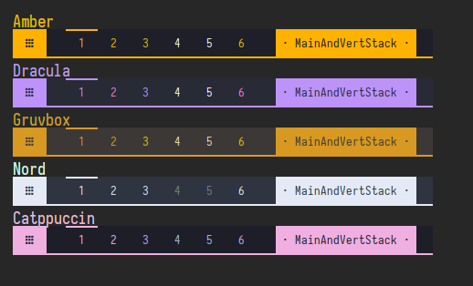
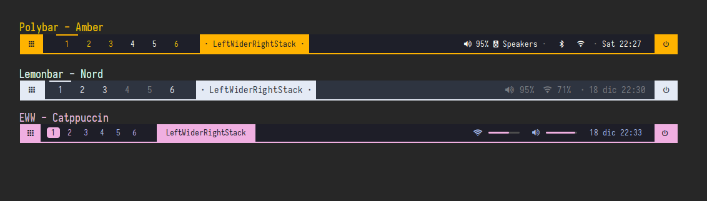
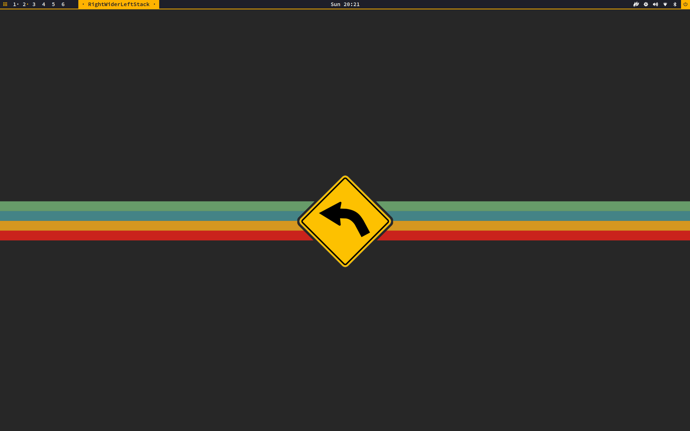
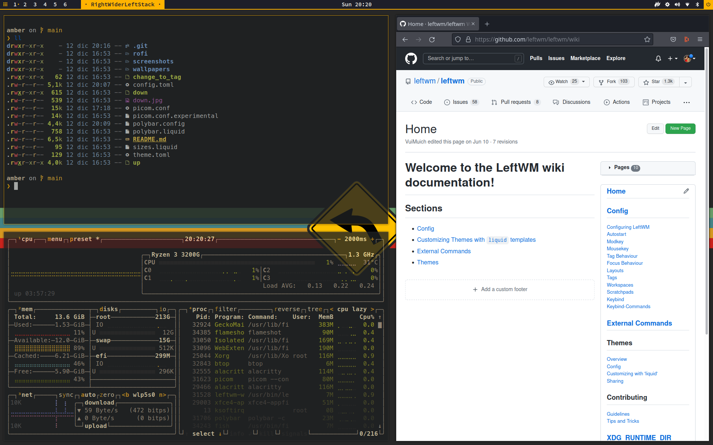
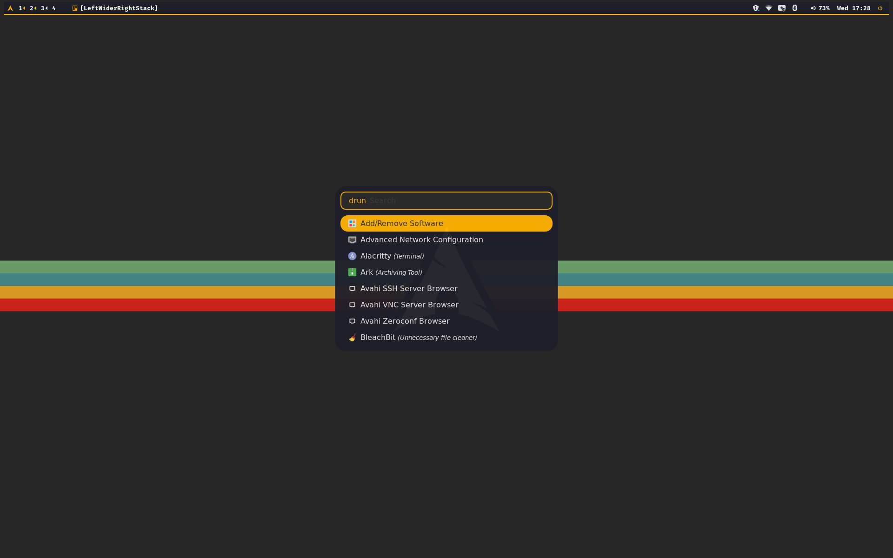
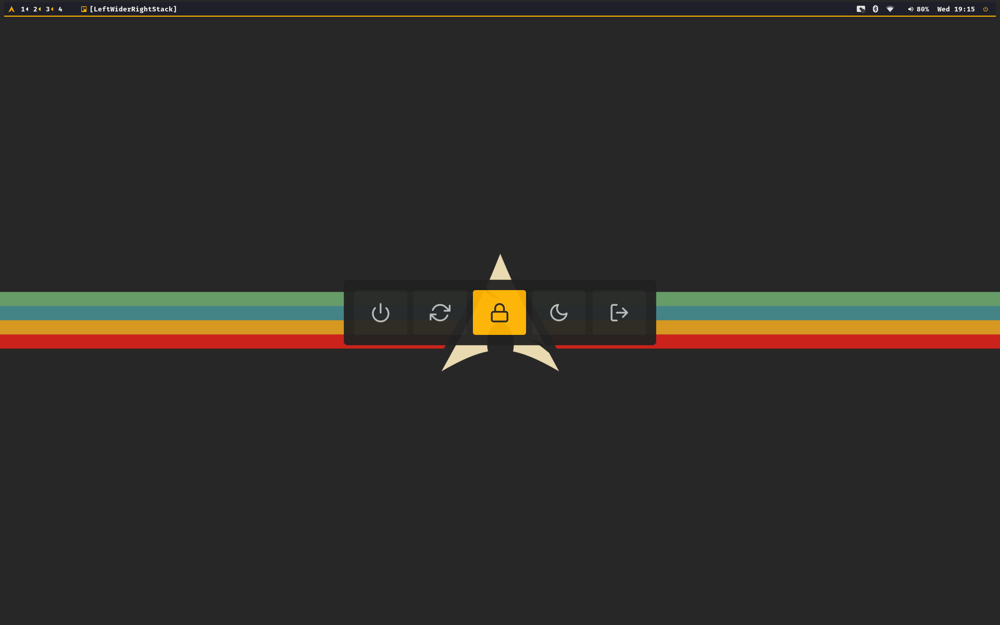
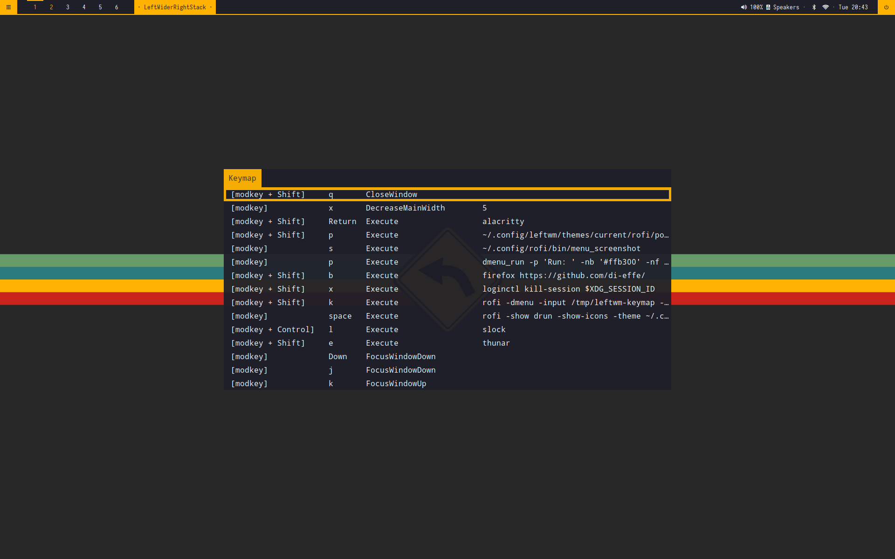
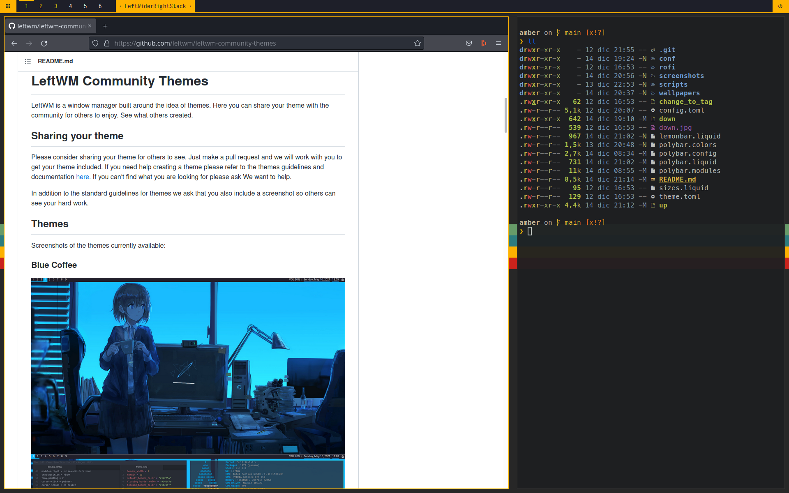
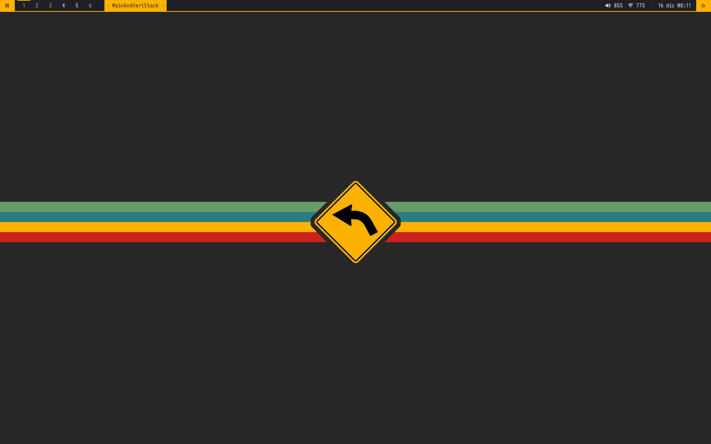
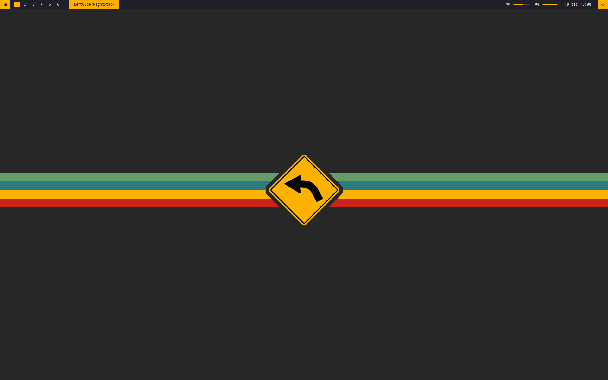

- [Amber](#amber)
- [Disclaimer](#disclaimer)
- [Features](#features)
- [Screenshots](#screenshots)
- [Dependencies](#dependencies)
- [Installation](#installation)
- [Color schemes](#color-schemes)
- [Statusbar selection](#statusbar-selection)
- [Configuration](#configuration)
  - [General](#general)
    - [Wallpapers](#wallpapers)
    - [Keymap](#keymap)
    - [dmenu](#dmenu)
  - [Polybar](#polybar)
    - [Pulseaudio Control](#pulseaudio-control)
    - [Systray](#systray)
    - [Layout module](#layout-module)
  - [Lemonbar](#lemonbar)
  - [EWW](#eww)
- [Changelog](#changelog)
  - [v0.2.2](#v022)
  - [v0.2.1](#v021)
  - [v0.2.0](#v020)
  - [v0.1.2](#v012)
  - [v0.1.1](#v011)
  - [v0.1.0](#v010)
  - [To do](#to-do)
- [Credit / Sources](#credit--sources)


# Amber
*A [LeftWM](https://github.com/leftwm/leftwm) minimalistic theme with very few gadgets, widgets and modules*


# Disclaimer
At the moment Amber is more like a rolling-release-theme, but I'll try to mark the main changes in the changelog below.
Also development and tests are done on ArcolinuxB, so that distro would likely satisfy most if not all dependencies automatically.


# Features
- multi monitor support
- multiple statusbar options (polybar / lemonbar / eww)
- color schemes




# Screenshots

**Polybar**





**Lemonbar (basic liquid implementation)** 

**Lemonbar (experimental wrapper)** 

**EWW** 



# Dependencies

- [LeftWM](https://github.com/leftwm/leftwm) - duh

`Fonts`
- Iosevka Nerd Font
- Roboto
- Noto Sans
- FontAwesome

In general it might be a good idea to install all [nerd fonts](https://www.nerdfonts.com/).

`Run by up script`

- polybar / lemonbar
- feh
- numlockx
- picom     

`Run by polybar (and keybindings)`

- dmenu 
- [rofi](https://github.com/davatorium/rofi) 
- [PulseAudio Control](https://github.com/marioortizmanero/polybar-pulseaudio-control)
- pavucontrol
- nm-connection-editor
- blueberry
- pamac

`Run by lemonbar`
- iwconfig

`Misc`
- alacritty (or change configs to match your terminal emulator)
- dunst / xfce4-notifyd  (adapt *up* script accordingly)
- [papirus-icon-theme](https://github.com/PapirusDevelopmentTeam/papirus-icon-theme)
- iwconfig 


# Installation
1. Install all required dependencies

2. Clone the repository in ~/.config/leftwm/themes

```BASH
cd ~/.config/leftwm/themes
git clone https://github.com/di-effe/amber.git
```

3. Remove the symlink to your current theme if set

```BASH
rm ~/.config/leftwm/themes/current
```
4. Set this as your current theme

```BASH
ln -s ~/.config/leftwm/themes/amber ~/.config/leftwm/themes/current
```

5. Restart your window manager

```Default shortcut
$MOD + Shift + r
```
**!!! IMPORTANT !!!**

Polybar is configured with an application launcher (left side) and a powermenu (right side). If you want to use them be sure to have **rofi** installed.

# Color schemes

Amber now comes with different color schemes, to better suit your mood or overall theme settings!
Edit your **up** script and chose:

```
# [ COLOR SCHEME ] ###########################################################
# Available themes:
# - amber
# - catppuccin
# - dracula
# - gruvbox
# - nord
source $SCRIPTPATH/scripts/colors.sh amber
##############################################################################
```

# Statusbar selection

By default Amber is running with a modular polybar configuration, but you can edit the **up** script to pick from:

```
# [ SETTINGS ] ###############################################################
# - CHOSE STATUS BAR
# 0) polybar
# 1) lemonbar (very basic implementation with app launcher, tags and powermenu)
# 2) eww (not yet ready)
STATUSBAR=0
##############################################################################
```

# Configuration 

## General

### Wallpapers

*up* is configured with the options to
- set random wallpapers from the /wallpapers folder
- set ONE wallpaper for all displays
- set MULTIPLE wallpapers for all displays (default)

Uncomment what you prefer and comment the rest. It should be clear enough reading the file.


### Keymap
At the moment this is a simple and dirty snippet of code placed in the *up* file

```
# KEYMAP

KEYBINDINGS=/tmp/leftwm-keybindings
if [ -f "$KEYBINDINGS" ]; then
    rm $KEYBINDINGS
fi
leftwm-check -v | \
grep Keybind | \
sed -e "s/Keybind: Keybind { command: //g;s/ } true//;s/ } false//" \
> $KEYBINDINGS


KEYMAP=/tmp/leftwm-keymap
if [ -f "$KEYMAP" ]; then
    rm $KEYMAP
fi

sort $KEYBINDINGS | \
tr -d '"' | \
sed -e "s/modifier: //g;s/key: //;s/value: None//;s/value: Some(//;s/)//;s/modkey,/modkey +/" | \
awk -F, '{print $3","$4","$1","$2}' | \
column -s ',' -t \
> $KEYMAP
```

What id does, hopefully, is to retrieve all key bindings to create a keymap to show using rofi.
My config.toml file is configured like this:

```
[[keybind]]
command = "Execute"
value = "rofi -dmenu -input /tmp/leftwm-keymap -window-title 'Keymap' -theme ~/.config/leftwm/themes/amber/rofi/keymap.rasi"
modifier = ["modkey", "Shift"]
key = "m"
```


### dmenu
I am using a custom dmenu color scheme. If you like to use pick it from the config.toml in this repository or configure yours like this:

```
[[keybind]]
command = "Execute"
value = "dmenu_run -p 'Run: ' -nb '#ffb300' -nf '#000000' -sb '#333333' -sf '#FFFFFF'"
modifier = ["modkey"]
key = "p"
```

## Polybar

### Pulseaudio Control
This is an interesting module you might want to use, just keep in mind it will grab your device description from

```
pactl list sinks | grep device.description
```

and that is usually a very long string.
The pulseaudio-control module in *polybar.modules* has been configured to use fancier nicknames for speakers and headphone, but you have to replace my values with yours.

For speakers (without any wired or bluetooth headphone connected) check
```
pactl list sinks short | cut -f2
```

and use the output here
```
--sink-nickname "VALUE_DETECTED_HERE:蓼 Speakers" 
```

For wired headphones, plug them, check again
```
pactl list sinks short | cut -f2
```

and use the output here
```
--sink-nickname "VALUE_DETECTED_HER: Headphones"
```


### Systray
Systray has beed disabled by default in *polybar.conig*
```
tray-position = none
```
If you want to use it change position and adjust the **tray-offset-x** value.


### Layout module
By default the layout module is configured in the template.layout file
```
%{O20}
%{A1:leftwm-command "NextLayout" :}%{A3:leftwm-command "PreviousLayout" :}
%{F#ffb300}%{F-} [{{ workspace.layout }}]
%{A}%{A}
```
You can chose to 
- remove it, deleting those lines
- keep it aligned to the left, but change the offset in the %{O20} field (those are 20 pixels)
- move it to the center of the screen, replacing %{O20} with %{c}

If you prefer to manage the module in your polybar.config file I left two modules
- layout0, for workspace0
- layout1, for workspace1


## Lemonbar

In the **up** script there are two options to run Lemonbar

```
# 1) Classic/simple mode - lemonbar generated by lemonbar.liquid
#leftwm-state -w $index -t $SCRIPTPATH/lemonbar.liquid | lemonbar -g "$width"x"$barheight"+"$x" -f "Iosevka Nerd Font"-11 -B"#1e1f29" -F"#f8f8f2" -u 2 -U"#ffb300"| sh&        
# 2) Experimental mode - lemonbar generated by a loop in lemonbar.worker  
exec ~/.config/leftwm/themes/current/lemonbar.worker $index | lemonbar -g "$width"x"$barheight"+"$x" -f "Iosevka Nerd Font"-11 -B"#1e1f29" -F"#f8f8f2" -u 2 -U"#ffb300"| sh&
```

**Classic/simple mode** will only parse what is configured inside *lemonbar.liquid*.

**Experimental mode** is an attempt to merge a liquid template, in this case *lemonbar.experimental.liquid*, with other simple info module like clock and volume. The core of this mode is the **lemonbar.worker** script.


## EWW
Nothing fancy here. Statusbar is controlled by **eww.yuck** and styled by **eww.scss**.
This last one is overwritten by the **up** script, according to the color theme selected. Source SCSS files for each theme are located in the */eww* folder.


# Changelog

## v0.2.2
- EWW statusbar

## v0.2.1
- Lemonbar experimental wrapper 
- Color schemes

**Notes**
I did my best to implement a Lemonbar asynchronous wrapper able to provide different kind of information at different rates, but each and every attempt broke the clickable areas or the multi-monitor support. In the end I rolled back to a simple and inefficient solution. I will get back to it sooner or later. 


## v0.2.0
- Lot of changes in polybar config and look
- Polybar modules (wlan, bluetooth, pulseaudio-control, arch/aur updates)
- Systray disabled by default
- Basic lemonbar implementation

## v0.1.2
- Minor improvements here and there

## v0.1.1
- Removed dependency from rofi-themes for applcation launcher
- Removed dependency from rofi-themes for powermenu

## v0.1.0
- Multi monitor support
- Amber color scheme
- Powermenu and application launcher (rofi-themes with some small tweaks)
- Picom conf for rounded corners and transparency for inactive windows
- Polybar modules to show and rotate layouts (left click next, right click previous)
- template.liquid config to show and rotate layouts (left click next, right click previous) 
- Keymap


## To do
- [x] Remove dependency on rofi-themes
- [x] A better tag module
- [x] Fallback fonts
- [x] ~~Volume slider (using volumeicon)~~(systray removed)
- [x] Modular polybar config
- [x] Basic lemonbar implementation
- [x] Lemonbar modules implementation (kinda)
- [ ] A better implementation for powermenu
- [ ] A better keymap implementation
- [x] eww statusbar
- [ ] ~~yambar statusbar~~
- [ ] ~~lesbar statusbar~~


# Credit / Sources
Built on top of [basic_polybar](https://github.com/leftwm/leftwm/tree/main/themes/basic_polybar) theme by LeftWM team.

And some inspiration / patches taken from these wonderful sources:

- @AethanFoot [leftwm-theme-dracula-rounded](https://github.com/AethanFoot/leftwm-theme-dracula-rounded) - No license. Author doesn't state permissions on code, will update as neccessary.

- @b4skyx [leftwm-soothe](https://github.com/b4skyx/leftwm-soothe) - No license. Author doesn't state permissions on code, will update as neccessary.

- @VentGrey [Epitaph](https://github.com/VentGrey/Epitaph/) - MIT License copyrighted by Qwart376, author of [Blue Coffee](https://github.com/Qwart376/Blue-Coffee. So I guess this is a russian-doll license thing now.

- Candy from Arcolinux team.

- Polybar modules configuration style (plus snippets and scripts) from [Peter Dauwe](https://github.com/PeterDauwe) and [adi1090x](https://github.com/adi1090x/polybar-themes)

Wallpapers by [Atlas-ark](https://www.reddit.com/user/atlas-ark/). I am not aware of any kind of licence, but if you can buy him a beer :)

Application launcher is based on the [rofi-themes-collection](https://github.com/lr-tech/rofi-themes-collection) by [LR Tech](https://github.com/lr-tech) covered by a GNU General Public License v3.0

Powermenu is loosely based on the [rofi-themes](hhttps://github.com/adi1090x/rofi) by [adi1090x](https://github.com/adi1090x) covered by a GNU General Public License v3.0


Ping me if I am messing up something here :)
